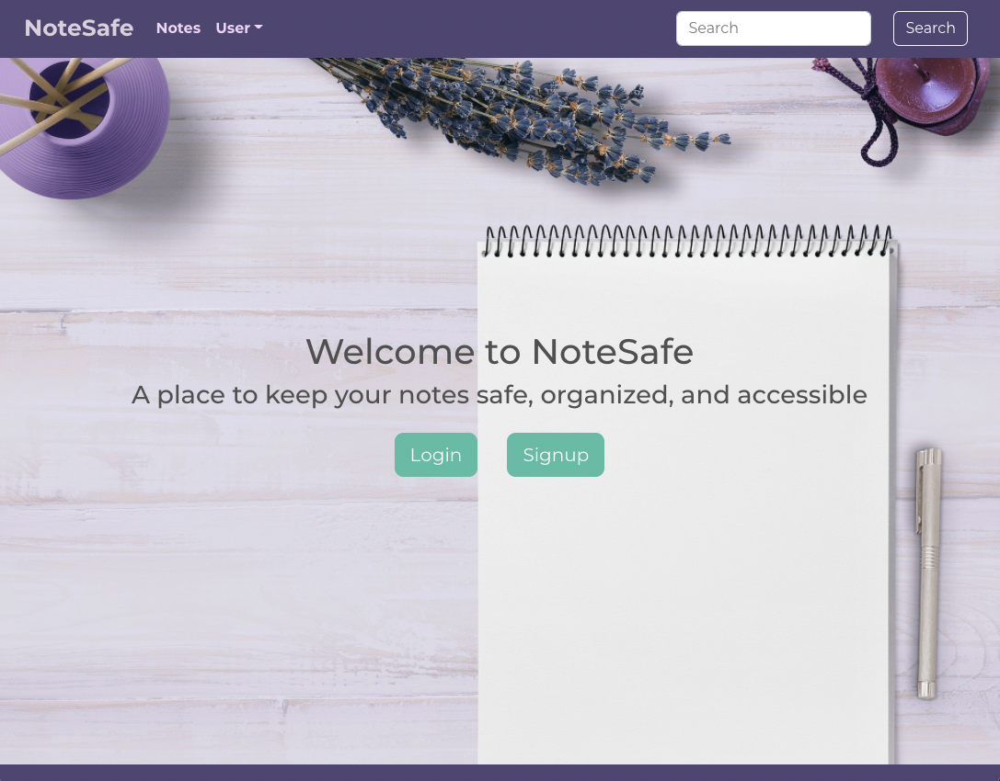

# Note-Safe

NoteSafe is a MERN stack application designed for people to create a profile and save notes for later. The notes associated with that user will be loaded on the Notes page, where they can view, edit, and delete their notes. 

## Technologies 

Main Stack
* [MongoDB](https://www.npmjs.com/package/mongodb) - Database
* [Express.js](https://www.npmjs.com/package/express) - Web framework/API
* [React.js](https://www.npmjs.com/package/react) - Front end
* [Node.js](https://nodejs.org/en/) - Server

Other Technologies
* Bcrypt - Password encryption/hash
* Redux - Application state
* [JSONWebToken](https://www.npmjs.com/package/jsonwebtoken) - Web token/user auth

## Screenshots/Demo

## Links

## License 